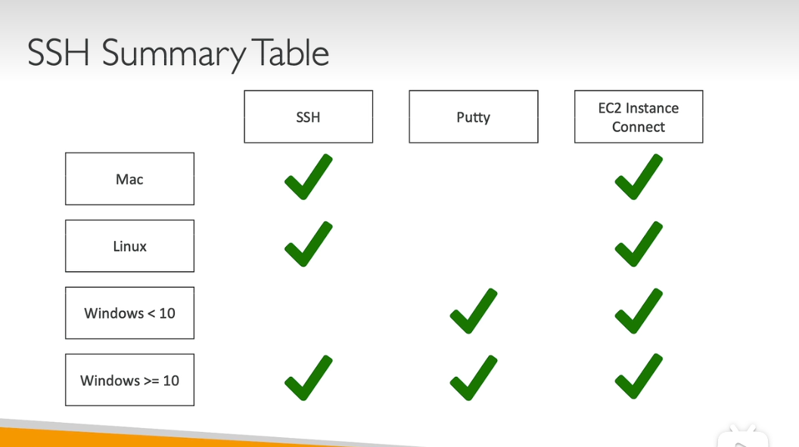

# Note

## IAM

## EC2

- Instance Type
- EC2 User Data
- Storage
  Size
  Delete on Termination
- Tags
  - Instances
  - Volumes
  - Network Interfaces
- Security Group
  Type
  Protocol
  Source:  0.0.0.0/0 anywhere
- Key Pair
  The key file is only show once in this step.
- Public IPv4 Address
- Private IPv4 Addresses

- Instance State
  - Stop Instance
  - Terminate Instance
  - Start Instance

## EC2 Instance Types

### Overview

- Naming
  - m: instance class
  - 5: generation (AWS Improved them over time)
  - 2xlarge: size within the instance class

- General Purpose
  - t2.micro
- Compute Optmized
  - C6g
  - HPC
  - Media transcoding
  - ML
  - Gaming Server
- Memory Optimized
  - R6g
  - BI
- Storage Optimized
  - i3
  - i, G, H

- Accelerated Computing
- Instance Featuers
- Measuring Instance Performance

## Security Groups

- Security Groups only contain allow rules
- Security Groups rules can reference by IP or by security group

### Deeper Dive

- Acting as a 'firewall' on EC2 Instances
- They regulate:
  - access to ports
  - authorised IP ranges - IPv4 and IPv6
  - Control of inbound network(from other to the instace)
  - Control of outbound network (from the instace to other)

### Good to know

- Can be attched to multiple instances
- Locked down to a regin/VPC combination
- Does live 'outsie' the EC2 - if traffice is blocked the EC2 isntacne won't seet it
- It's good to maintain one separate security group for SSH access
- If your application is not accessible (timeout), then it's a security group issue.
- If your application gives a 'connection refused' error, then it's an applcation error or it's not launched
- All inbound traffice is blokced by default

### Classic Ports to know

- 22 = SSH
- 21 = FTP
- 22 = SFTP
- 80 = HTTP
- 443 = HTTPS
- 3389 = RDP

### SSH Summary Table

### Which Lectures to watch

- Mac / Linux:  SSH
- Windows: Putty Lecture
- Windows 10: SSH on Windows 10 lecture
- All: EC2 Instance Connect lecture

If things don't work...
- Re-watch the lecture. You may have missed someting
- Read the troubleshooting guide
- Try EC2 Instance Connect

### IAM Role for EC2 Instance

- EC2 Instance > Seucrity > Security details > IAM Role

### EC2 Instances Purchasing Options
