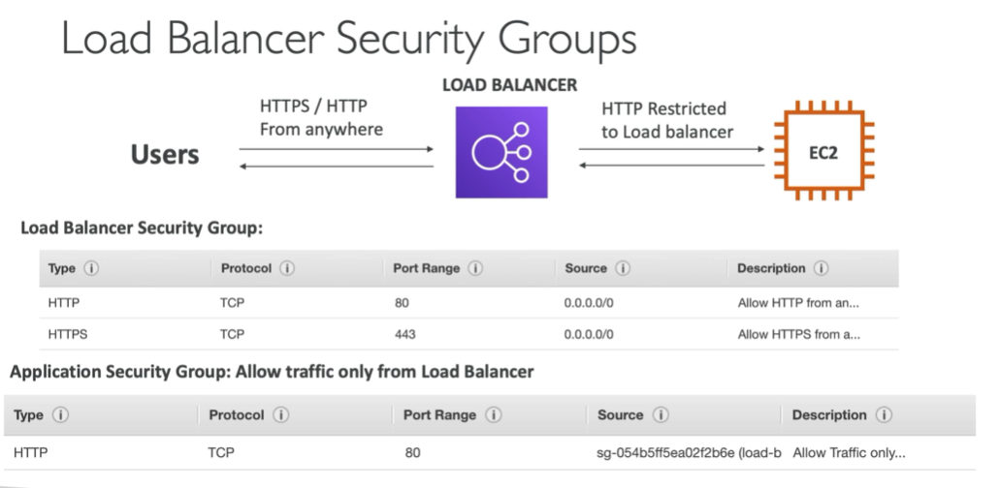

# Note

## IAM


## EC2

- Instance Type
- EC2 User Data
- Storage
  Size
  Delete on Termination
- Tags
  - Instances
  - Volumes
  - Network Interfaces
- Security Group
  Type
  Protocol
  Source:  0.0.0.0/0 anywhere
- Key Pair
  The key file is only show once in this step.
- Public IPv4 Address
- Private IPv4 Addresses

- Instance State
  - Stop Instance
  - Terminate Instance
  - Start Instance

## EC2 Instance Types

### Overview

- Naming
  - m: instance class
  - 5: generation (AWS Improved them over time)
  - 2xlarge: size within the instance class

- General Purpose
  - t2.micro
- Compute Optmized
  - C6g
  - HPC
  - Media transcoding
  - ML
  - Gaming Server
- Memory Optimized
  - R6g
  - BI
- Storage Optimized
  - i3
  - i, G, H

- Accelerated Computing
- Instance Featuers
- Measuring Instance Performance


## Security Groups

- Security Groups only contain allow rules
- Security Groups rules can reference by IP or by security group

### Deeper Dive

- Acting as a 'firewall' on EC2 Instances
- They regulate:
  - access to ports
  - authorised IP ranges - IPv4 and IPv6
  - Control of inbound network(from other to the instace)
  - Control of outbound network (from the instace to other)

### Good to know

- Can be attched to multiple instances
- Locked down to a regin/VPC combination
- Does live 'outsie' the EC2 - if traffice is blocked the EC2 isntacne won't seet it
- It's good to maintain one separate security group for SSH access
- If your application is not accessible (timeout), then it's a security group issue.
- If your application gives a 'connection refused' error, then it's an applcation error or it's not launched
- All inbound traffice is blokced by default


### Classic Ports to know

- 22 = SSH
- 21 = FTP
- 22 = SFTP
- 80 = HTTP
- 443 = HTTPS
- 3389 = RDP


### SSH Summary Table


### Which Lectures to watch

- Mac / Linux:  SSH
- Windows: Putty Lecture
- Windows 10: SSH on Windows 10 lecture
- All: EC2 Instance Connect lecture

If things don't work...
- Re-watch the lecture. You may have missed someting
- Read the troubleshooting guide
- Try EC2 Instance Connect


### IAM Role for EC2 Instance

- EC2 Instance > Seucrity > Security details > IAM Role


### EC2 Instances Purchasing Options

- On-Demand Instances
  - Pay for what use
  - Has the highest cost but no upfront payment
  - No long-term commitment
  - Recommended for short-term and un-interrupted worloads, where you can't predict how the application will behave
- Reserved: minimum 1 year
  - Reserved Instance
    - Up to 75 discount compared to on-demand
    - Reservation period: 1 year = + discount | 3 years = +++ discount
    - Purchasing options: no upfront | partinal upfront = +| All upfront = ++discount
    - Reverse a specfic instance type
    - Recommended for steady-state usage applcations (think databae)
  - Covertaible Reserved Instance
    - can change the EC2 instace type
    - Up to 54% discount
  - Scheduled Reserved Instances
    - launch within time window you reserve
    - When you require a fraction of day/week/month
    - Still commitment over 1 to 3 years
- Spot Instances
  - Cat get a discount of up to 90% compared to On-demond
  - Instaces that you can 'lose' at any point of time if your max price is less thean the cruuent spot price
  - The most cost-efficient instances in AWS
  - Useful for workflows that are resilient to failure
  - Not suitable for critical jobs or databases
- Dedicated Host: book an entire physical server, control instance placement
  - An amazson EC2 Dedicated Host is a physical server with EC2 instance capacity fully dedicated to your use. Dedicated Hosts can help you address compliacne requirements and reduce costs by allowing you to use your existing server-bound software licenses.
  - Allocated fro your account for a 3-years period reservation
  - More expensive
  - Useful for software that have complicated licensing model(BYOL - Bring Tour Own License)
  - Or for companies that have string regulatory or compliance needs
- EC2 Dedicated Instacnes
  - Instances running on hardware that's dedicated to your
  - May share HW with other isntances in same account
  - No control over instance placement (can move hw after stop/start)
    

- Price Comparision


### EC2 Spot Instance Requests

- EC2 Spot Instance Requests
  - Can get a discount of up to 90% compared to On-demond
  - Define max spot price and get the instance while current spot price < max
    - The hourly spot price varies based on offer and capacity
    - If the current price > your max price you can choose to stop or terinate your instance with a 2 minutes grace period
  - Other strategy: Spot Block
    - 'block' spot instance during a specified time frame (1 to 6 horus) without interruptions
    - In rare sisuations, the instance may be reclaimed
  - Used for batch jbos, data analysis, or workloads that are resilient for failures
  - Not great for critical jobs or databases

- EC2 Spot Instsances Pricing
  [](https://.../ec2sp/v1/spot/home?region=us-east-1)

- How to terminate Spot Instances
  

- Spot Fleets
  - Spot Fleets = set of spot Instances + (optional) On-Demond Instances
  - The Spot Fleet will try to meet the target capacity with price constraints
    - Define possible launch pools: instance type (m5.large), OS, Availability Zone
    - Can have multiple launch pools, so that the fleet can choose
    - Spot Fleets stops launching instances when reaching capacity or max cost
  - Strategies to allocated Spot Instances:
    - lowestPrice:
    - deversifiend:
    - capacityOptimized
  - Spot Fleets allow us the auto request Spot Instances wiht the lowest price

### EC2 Spot Instance Launch Types Hands On

- [045 EC2 Instances Launch Types Hands On_哔哩哔哩_bilibili](https://www.bilibili.com/video/BV1wR4y1F7YM/?p=40&spm_id_from=pageDriver&vd_source=b12b77fc1ee1a9f1bd40e7d3802aa43c)


### Private vs Public IP (IPv4)

- Private vs Public IP (IPv4)
  - Sorts of IPs. IPv4 and IPv6
  - IPv4 allows for 3.7 billion 

- Public IP
  - Can be geo-located easily
- Private IP

- Elastic IPs
  - 5 elastic IP
  - try to avoid using Elastic IP


### Placement Groups

- Placement Groups
  - You want control over the EC2 Instance placement strategy
  - The strategy can be defined using placement groups
  - When you create a placement group, you specify one of the following strategies for the group
    - Cluster - clusters instances into a low-latency group in a single AZ
      
    - Spread - spreads isntances across underlying hw (max 7 isntances per group per AZ) - critical applcations
      
    - Partition - spreads instances across many different partitions (which repy on diffrenet sets of racks) within an AZ. Scales to 100s of EC2 isntaces per group.
      


### Elastic Network Interface (ENI)

- Elastic Network Interface (ENI)
  - Logical compoenet in a VPC that represents a virtual network card
  - The ENI can have the following attributes
    - Primary private IPv4, one ore more secondary IPv4
    - One Ealstic (IPv4) per private IPv4
    - One Public IPv4
    - Onre ore more security groups
    - A MAC address
  - You can create ENI independently and attach them on the fly (move them) on EC2 instances for failover
  - Bound to a specific AZ

### EC2 Hibernate

- EC2 Hibernate
  - EC2 status
    - Stop:
    - Terminate: EBS is destroyed
  - On start
    - First start: the OS boot & the EC2 user Data scripts is run
    - Following starts: the OS boots up
- Intrudcing EC2 Hibernate
  - The in-memory state is preserved
  - The instance boot is much faster
  - Under the hood: the RAM state is written to a file in the root EBS volume
  - Thr oot EBS volume must be encrypted
- Use cases
  - long-running processing
  - saving the RAM state
  - services that take time to intialize
-  Good to know
  - Supported instance families
  - Instance RAM size- must less than 150 GB
  - Instance size: not supported for bare metal instances
  - AMI: all AMIs
  - Root Volume: must be EBS
  - Available for On-Demond and Reserved instances
  - An instance cannot be hibernated more than 60 days.


### EC2 Hibernate Hands on

- EC2 Hibernate
  - Enable hibernation as an additinal stop behavior
  - Ensure hinernate is working
    - Hibernate the instace
       - Use `uptime` to check hinernation


### EC2 Nitro


- EC2 Nitro
  - Underlying Platform for the next neneration of EC2 instances
  - New virtualization technology
  - Allow for better performance
    - Better networking options(enhanced networking, HPC, IPV6)
    - Higher Speed EBS (64000 EBS IOPS - max 32000 on no-Nitro)
  - Better underlying security
  - Instance types example:
    - Virtualized: 
    - Bare metal:
- EC2 - Understanding vCPU
  - Multiple threads can run on one CPU (multithreading)
  - Each treahd  is represented as virtual CPU (vCPU)
  - Example: m5.2xlarge
    - 4 CPU
    - 2 threads per CPU
    - => 8 vCPU in total
    
- EC2 - Optimzing CPU options
  - EC2 isntances come with a combination of RAM and vCPU
  - But in some cases, you may want to change the vCPU options:
    - # of CPU cores: you can decreast it (helpful if your need high RAM and low number of CPU) - to decrease licensing costs
    - # of threads per core: disable multithreading to have 1 thread per CPU - helpful for high performance computing (HPC) workloads
  - Only speficied during instance launce
  

- EC2 - Capacity Reservations
  - Capicity Reservations ensure your have EC2 Capacity when needed
  - Manual or planned end-date for the revervation
  - No need for 1 or 3-year commitment
  - Capicity access is immediate, you get billed as soon as it starts
  - Specify
    - The AZ in which to to rerve the capcity (only one)
    - The number of instances for which to reserve capacity
    - The instance attributes, including the instance types, tenancy and platform/OS
  - Combine with Reserved Instaces and Savings Plans to do cost saving
  

- EC2 Instance Storage Section
  - What's EBS Volume
    - is a network drive you can attach to your instances while they run
    - allows your instances to persists data, even after their termination
    - can only be mounted to one instance at a time(at the CCP level)
    - The are bound to specific AZ
    - Analogy: Think of them as a 'network USB stick'
  - EBS Volume
    - It's a network drive (not a physical drive)
      - It uses the network to communicate the instance, which means there might be a bit of latency
      - It can be deatched from an EC2 instacne and attached to another one quickly
    - It's locked to an AZ
      - An EBS Volume in us-east-1a cannot be attached to us-east-1b
      - To move a volume across, you first need to snapshot it
    - Have a provisioned capacity (size in GBs, and IOPS)
      - You get billed for all the provisioned capacity
  - EC2 Volume - Example
    
  - EBS - Delete on termination attribute
    - Controls the EBS behaviour when an EC2 instance terminates
      - By default, the root EBS volume is deleted
      - By default, any ohter attached EBS vloume is not deleted
    - This can be controlled by the AWS console/AWS CLI
    - Use case: persrve root volume when instance is terminated
    
   - EBS Volume Hands on
    - Create a volume
    - Attach the volume to an existed EC2 instance
    - Create the new EC2 instance from the volume
    - Delete the volume


- AMI Overview
  - AMI = Amazson Machine Image
  - AMI are a customization of EC2 instance
    - You add your own software, configuration, operation system, monitoring...
    - Faster boot / configuration time because all your software is pre-packaged
  - AMI are build for specific region (and can be copied accross regions)
  - You can launch EC2 instances from
    - A public AMI: AWS provided
    - Your own AMI: you make and maintain them yourself
    - An AWS Marketplace AMI: an AMI someone else made (and potentially sells)

- AMI Process (from an EC2 instace)
  - Start an EC2 instance and customize it
  - Stop the instance (from dataw integrity)
  - Build an AMI - this will also create EBS snapshots
  - Launch instances from other AMIs
  

- AMI Hands on
  - EC2 user data
  - Launch an EC2 instance
  - Create an AMI image from an EC2 Instance

- EC2 Instance Store
  - EBS volumes are network drives with good but "limited" performance
  - If you need a high-performance hardware disk, use EC2 Instance Store
  - Better I/O Performace
  - EC2 Instance Store lose their storage if they're stopped (ephemeral)
  - Good for buffer / cache / scratch data / temorary content
  - Rick of data loss if hardware fails
  - Backups and Replication are your responsibility

- Load EC2 Instance Store
  

- EBS Volume Types
  - EBS Volumes come in 6 types
    - gp2 / gp3 (SSD)
    - io1 / io2 (SSD)
    - st1 (HDD)
    - sc1 (HDD)
  - EBS Volumes are characterized in Size | Throughput | IOPS (I/O Ops Per Sec)
  - Wnen in doubt always consult the AWS documentation - it's good
  - Only gp2/gp3 and io1/io2 can be used as boot volumes
 
- EBS Volume Types Use cases
  - General Purpose SSD
    - Cost effective storage, low-latency
    - System boot volumes, Virtual desktops, Development and test environments
    - 1GiB - 16 Tib
    - gp3
      - Baseline of 3000 IOPS and throughtput of 125 MiB/s
      - Can increase IOPS up to 16000 and throughput up to 1000 MiB/s independently
    - gp2
      - Small gp2 volumes can burst IOPS to 3000
      - Size of the volume and IOPS are linked, max IOPS is 16000
      - 3 IOPS per GB, means at 5334 GB we are at max IOPS
  - Provisioned IOPS (PIOPS) SSD
    - Critical business applications with sustained IOPS performance
    - Or applications that need mroe than 16000 IOPS
    - Create for database workloads (sensitive to storage perf and consitency)
    - io1/io2 (4 GiB -  16 TiB)
      - Max PIOPS: 64000 for Nitro EC2 instances & 32000 for other
      - Can increate PIOPS independently from storage size
      - io2 have more durabilty and more IOPS epr GiB (at the same price as io1)
    - io2 Block Express (4 GiB - 16 TiB)
      - Sub-milisecond latency
      - Max PIOPS: 25600 with an IOPS: GiB ration of 1000:1
    - Support EBS Multi-attach
  - Hard Disk Drives (HDD)
    - Cannot be a boot volume
    - 245 MiB to 16 TiB
    - Throughput Optimized HDD (st1)
      - Big Data, Data warehouses, Log Processing
      - Max Throughput 500 MiB/s - max IOPS 500
    - Cold HDD (sc1):
      - For data that is infrequently accessed
      - Scenarios where lowest cost is important
      - Max throughput 250 MiB/s - max IOPS 250
  

- EBS Multi-Attach - io2/io3 family
  - Attach the same EBS volume to multiple EC2 isntances in the same AX
  - Each isntance has full read & write permissions to the volume
  - Use case
    - Archieve higher applcation availability in cloustered Linux applications (exL Teradata)
    - Applications must manage concurrent write operations
  - Must us a file system that's clsuter-sware (not XFS, EX4, etc...)


- EBS Encryption
  - When you create an encrypted EBS volume, you get the following
    - Data a rest is encrypted inside the volume
    - All the data in flight moving between the instance and the volume is encrypted
    - All snapshot are encrypted
    - All volumes created from the snapshot
  - Encryption and decryption are handled trasparently (you have nothing to do)
  - Encryption has minimal impack on latency
  - EBS Encryption leverages keys from KMS (AES-256)
  - Copying an unencrypted snapshot allows encryption
  - Snapshots of encrypted volumes are encrypted

- Encryption: encrypt an unencrypted EBS volume
  - Create an EBS snapshot of the volume
  - Encrypt the EBS snapshot (using copy)
  - Create new EBS volume from the snapshot (the volume will also be encrypted)
  - Now you can attach the encrypted volume to the original instance


- EFS - Elastic File System
  - Managed NFS (network file system) that can be mounted on many EC2
  - EFS works with EC2 instance multi-AZ
  - Highly available, scalable, expensive (3xgp2), pay per use
  - Use cases: content management, web serving, data sharing, wordpress
  - Use NFSv4.1 protocol
  - Uses security group to control access to EFS
  - Compatible with Linux based AMI (not Windows)
  - Encryption at rest using KMS
  - POSIX file system (~Linux) that has a standard file API
  - File system scales automatically, pay-per-use, no capacity planning
  

- EFS - Performance & Storage Classes
  - EFS Scale
    - 1000s of concurrent NFS clients, 10 GB+/s throughput
    - Grow to petabyte-scale network file system, automatically
  - Performance mode (set at EFS creation time)
    - General purpose (default): latency-sensitive use cases (web server, CMS, etc...)
    - Max I/O - higher latency, throughtput, highly parallel (big data, media processing)
  - Throughput mode
    - Bursting (1TB = 50MiB/s + burst of up to 100 MiB/s)
    - Provisioned: set thorughput regardless of storage size, ex: 1GiB/s for 1TB storage
  - Storage Tiers (lifecycle management feature = move file after N days)
    - Standard: for frequently accessed files
    - Infrequent access (EFS-IA): const to retrieve files, lower price to store
- EFS hands on
  - Create EFS shared the data data between 2 EC2 instance

- EBS vs EFS - Elastic Block Storage
  - EBS volumes
    - can be attached to only one instance at a time
    - are locked at the AZ level
    - gp2: IO increases if the disk size increases
    - ip1: can increase IO independently
  - To migrate an EBS volume across AZ
    - Take a snapshot
    - Restore the snapshot to another AZ
    - EBS backups us IP and you shouldn't run them while your applcation is handling a lot of traffic
  - Root EBS Volumes of instances get terminated by default if the EC2 instance gets terminated. (you can disable that)
- EBS vs EFS - Elastic File System
  
  - Mounting 100s of instances across AZ
  - EFS share website files (WordPress)
  - Only for Linux Instances (POSIX)
  - EFS has a higher price point than EBS
  - Can leverage EFS-1A for cost savings
  - Remember: EFS vs EBS vs Instance Store
- EBS vs EFS - Cleanup

- Scalability & High Availability
  - Scalability means that an application / system can handle greater loads by adapting
  - There are two kinds of scalability
    - Vertical Scalability
    - Horizontal Scalability (-elasticity)
  - Scalability is linked byt different to High Availability
  - Let's deep dive into the distinction, using a call center as an example
- Vertical Scalability
  - Vertically scalability means increasing the size of the instance
  - For example, your applcations runs on a t2.micro
  - Scaling that application vertically means running it on a t2.large
  - Vertical scalability is very common for non-distributed systems, such as a database
  - RDS, ElaticCache are services that can scale vertically
  - There's usually a limit to how much you can vertically scale (hardware limit)
- Horizontal Scalibility
  - Horizontal Scalability means increasing the number of instances / systems for your applcations
  - Horizontal scaling implies distributed systems
  - This is very common for web applications / modern applcations
  - It's easy to horizontally scale thanks the cloud offerings such as Amazon EC2
- High Avaliability
  - High Availability usually goes hand in hand with horizontal scaling
  - High Availability means running your application / system in at least 2 data center (==AZ)
  - The goal of HA is to survive a data center loss
  - The HA can be passive (for RDS Multi AZ for example)
  - The HA can be active (for horizontal scaling)
- High Avaliability & Scaliability For EC2
  - Verical Scaling: Increasing instance size (=scale up/down)
    - From: t2.nano - 0.5G of RAM, 1 vCPU
    - To: u-12tbl.metal - 12.3 TB of RAM, 448 vCPUs
  - Horizontal Scaling: Increase number of instances (=scale out/in)
    - Auto Scaling Group
    - Load Balancer
  - High availability: Run instances for the same application across multi AZ
    - Auto Scaling Group multi AZ
    - Load Balancer multi AZ

- What is load balacing
  - Load Blanaces are servers that forward traffice to multiple servers (e.g. EC2 instances) downstream
  

- Why use a load balancer
  - Spread load across multiple downstream instances
  - Expose a single point of access (DNS) to your application
  - Seamlessly handle failures of downstream instances
  - Do regular health checks to your instances
  - Provide SSL termination (HTTPS) for your websites
  - Enforce stickiness with cookie
  - High availability across zones
  - Separate public traffic from private traffic

- Why use an Elastic Load Balancer
  - An Elastic Load Balancer is a managed load balancer
    - AWS guarantees that it will be working
    - AWS takes care of upgrades, maintenance, high availability
    - AWS provides only a few configuration knobs
  - It costs less to setup your own load balancer but it will be a lot more effort on your end
  - It is integrated with many AWS offerings / services
    - EC2, EC2 Auto Scaling Groups, Amazon ECS
    - AWS Certificate Manager (ACM), CloudWatch
    - Route 53, AWS WAF, AWS Global Accelerator

- Health Checks
  - Health Checks are crucial for Load Balancers
  - They enable the load balancer to know if instances it forwards traffice to are available to reply to requests
  - The health check is done on a port and a route (/health is common)
  - If the response is not 200 (OK), then the isntance is unhealthy
  

- Types of load balanced on AWS
  - AWS has 4 kinds of managed Load Balancers
    - Classic Load Balancer (v1 - old generation) - 2009 - CLB
      - HTTP, HTTPS, TCP, SSL (secure TCP)
    - Application Load Balancer  (v2 - new generation) - 2016 - ALB
      - HTTPS, HTTPS, WebSocket
    - Network Load Balancer - 2017 - NLB
      - TCP, TLS (secure TCP), UDP
    - Gateway Load Balancer - 2020 - GWLB
      - Operates at layer 3 (Network layer) - IP Protocol
  - Overall, it is recommended to use the newer generation load balancers as they provide more features
  - Some load balancers can be setup as internal (private) and external (public) ELBs

- Load Balancer Security Groups
  

  
- Classic Load Balancers (v1)
  - Supports TCP (Layer 4), HTTP & HTTPS (Layer 7)
  - Health checks are TCP or HTTP based
  - Fixed hostname
    xx.regioin.elb.amazonaws.com
  

- Classic Load Balancers Hands on
  - Create EC2 instance
  - Create a Classic Load Balancers
    - Configure assign security groups: HTTP
      - only from CLB
    - Configure health check
      
    - Add EC2 instances
      3 EC2 instance

- Application Load Balancer (v2)
  - Application load balancer is layer 7 (HTTP)
  - Load balancing to multiple HTTP applications across machines (target groups)
  - Load balancing to multiple applcations on the same machine (ex: containers)
  - Support for HTTP/s and WebSocket
  - Support redirects (from HTTP to HTTPS for example)
  - Routing tables to different target groups
    - Routing bases on path in URL
    - Routing based on hostname in URL
    - Routing based on Query String, Headers
  - ALB are a great fit for micro  services & container-based applcation (example: Docker & Amazon ECS)
  - Has aport mapping feature to redirect to a dynamic port in EC2
  - In comparison, we'd need multiple Class Load Balancer per application
  

- Application Load Balancer (v2) - Target Groupss
  - EC2 instances (can be managed by an Auto Scaling Group)
  - ECS stasks (managed by ECS itself)
  - Lambda functions - HTTP request is translated into a JSON event
  - IP Addresses - must be private IPs
  - ALB can route to multiple target groups
  - Health checks are at the target group level

- Application Load Balancer (v2) - Query String/Parameter Routing
  

- Application Load Balancer (v2) - Good to know
  - Exied hostname (XX.region.elb.amazonaws.com)
  - The application servers don't see the IP of the client directly
    - The true IP of the client is inserted in the header X-Forwarded-For
    - We can also get Port (X-Forwarded-Port) and proto (X-Fowarded-Proto)
    

- Application Load Balancer (v2) - Hands on
  - Create Application Load Balancer
    - Internet-facing
    - Security Groups
    - Listeners and routing
      - target group: instances
        - 3 instances
        - Rules
          - Path
          - Request


- Network Load Balanced (v2)
  - Network load balancer (Layer 4) allow to
    - Forward TCP & UDP traffic to your instances
    - Handle millions of request per seconds
    - Less latency ~100ms (vs 400 ms for ALB)
  - NLB has one static IP per AZ, and supports assigning Elastic IP (helpful for whitelisting specific IP)
  - NLB are used for extreme performance TCP or UDP traffic
  - Not included in the AWS free tier
  

- Network Load Balanced (v2) - Target Group
  - EC2 Instances
  - IP Addresses - must be private IPs
  - Application Balancer
    

- Network Load Balanced (v2) - Hands on
  - Create Network Load Balancer
    - Internet-facing
    - Listeners and routing
      - TCP 80: Taget Group
  - Create a Target Group

- Gateway Load Balancer
  - Deploy scale and manage a fleet of 3rd party network virtual applianaces in AWS
  - Example: Firewalls, intrusion Detection and Prvention Systems, Deep Packet Inspection System, payload manipulation...
  
  - Operates at Layer 3 (Network Layer) - IP Packets
  - Combines the following functions:
    - Transparent Network Gateway - single entry/exit for all traffic
    - Load Balancer - distriubtes traffic to your virtual appliances
  - Uses the GENEVE protocol on port 6081
- Gateway Load Balancer - Target Groups
  - EC2 instances
  - IP Addresses - must be private IPs
  

- Sticky Sessions (Session Affinity)
  - It is possible to implement stickiness so that the same client is always redirected to the same instance behind a load balancer
  - This works for Class Load Balancers & Application Load Balancers
  - The "cookie" used for stickiness has an expiation date you control
  - Use case: make sure the use doesn't lose hias session data
  - Enabling stickiness may bring inbalance to the load over the backend EC2 instances
  

- Sticky Sessions - Cookie Names
  - Application-based Cookies
    - Custom cookie
      - Generated by the target
      - Can include any custom attriubtes required by the application
      - Cookie name must be specified individually for each target grouo
      - Don't use AWSLAB, AWSALBAPP, or AWSALBTG (reserved for use by the ELB)
    - Application cookie
      - Generated by the load balancer
      - Cookie name is AWSALBAPP
  - Duration-based Cookies
    - Cookie generated by the load balancer
    - Cookie name is AWSALB for ALB, AWSELB for CLB

- Cross-Zone Load Balancing
  
  - Appliation Load Balancer
    - Always on (can't be disabled)
    - Not charges for inter AZ data
  - Network Load balancer
    - Disable by default
    - You pay charges ($) for inter AZ data if enabled
  - Classic Load balancer
    - Disable by default
    - No charges for inter AZ data if enabled
- Cross-Zone Load Balancing - Hands on

- SSL/TLS - Basics
  - An SSL Certificate allows traffice between your clients and your load balancer to be encrypted in transit (in-flight encryption)
  - SSL refers to Secure Socket Layer, used to encrypt connections
  - TLS refers to Transport Layer Security, which is a new version
  - Nowadays, TLS certificateds are mainly used, but people still refer as SSL
  - Public SSL certificates are issued by Certificate Authorities (CA)
  - Combodo, Symantec, GoDayy, GlobalSign, Digicert, Letsencrypt, etc...
  - SSL certificates have an expiration date(you set) and must be renewed

- Load Balancer - SSL Certificates
  
  - The load balancer uses an X.509 certificate (SSL/TLS server certificate)
  - You can manage certificates using ACM (AWS Certificate Manager)
  - You can create upload your own certificates alternatively
  - HTTPS listener
    - You must specify a default certificate
    - You can add an optinal list of certs to support multiple domains
    - Client can use SNI (Server Name Indication) to specify to hostname they reach
    - Ability to specify a security policy to support older versions of SSL/TLS (legacy clients)

- SSL - Server Name Indication
  - SNI solves the problem of loading multiple SSL certificates onto one web server (to serve multiple websites)
  - It's a "newer" protocol and requires the client to indicate the hostname of the target server in the initial SSL handshake
  - The server will then find the correct certificate, or return the default one

  - Note
    - Only works for AALB & NLB (newer generation), Cloudfront
    - Does not work for CKB (old gen)
  

- Elastic Load Balancers - SSL Certificates
  - Classic Load Balancer (v1)
    - Support only one SSL certificate
    - Must use multiple CLB for multiple hostname with mulple SSL certificates
  - Application Load Balancer (v2)
    - Supports multiple listeners with multiple SSL certificates
    - Uses Server Name Indication (SNI) to make it work
  - Network Load Balancer (v2)
    - Supports Multiple listeners with multiple SSL certificates
    - Uses Server Name Indication (SNI) to make it work
  - Hands on
    - Edit Listeners in CLB/ALB/NLB
      - Load Balancer Protocol: HTTPS (Secure HTTP)
      - Cypheer: Predefined Security Policy
      - Certificate: select or upload the certificate 

- Connection Draining
  
  - Feature naming
    - Connection Draining - for CLB
    - Deregistraion Delay - for ALB & NLB
  - Time to complete "in-flight requests" while the instance is de-registering or unhealthy
  - Stops sending new requests to the EC2 instance which is de-registering
  - Between 1 to 3600 seconds (default: 300 seconds)
  - Can be disabled (set value to 0)
  - Set to low value if your requests are short


- What's an Auto Scaling Group
  - In real-life, the load on your websites and application can change
  - In the cloud, you can create and get rid of servers very quickly
  - The goal of an Auto Scaling Group (ASG) is to
    - Scale out (add EC2 instances) to match a increased load
    - Scale in (remove EC2 instances) to match a decreased load
    - Ensure we have a minimum and a maximum number of machines running
    - Automatically Register new instances to a load balancer
- Auto Scaling Group in AWS
  - Minimum size
  - Acutual Size
  - Desired Capacity
  - Maximum size
  
- Auto Scaling Group in AWS - With Load Balancer
  
- ASGs have the following attributes
  - A launch configuration
    - AMI + Instance Type
    - EC2 User Data
    - EBS Volumes
    - Security Groups
    - SSH Key Pair
  - Min Size / Max Size / Initial Capacity
  - Network + Subnet info
  - Load Balancer info
  - Scaling policies
- Auto Scaling Alarms
  - It is possible to scale an ASG based on CloudWatch alarms
  - An Alarm monitors a metric (such as Average CPU)
  - Metrics are computed for the overall ASG instances
  - Base on the alarm
    - We can create scale-out policies (increase the number of instances)
    - We can create scale-in policies (decrease the number of instances)
  

- Auto Scaling New Rules
  - It is now possible to define "better" auto scaling rules that are directly managed by EC2
    - Target Average CPU Usage
    - Number of request on the ELB per instance
    - Average Network In
    - Average Nutwork Out
  - These rules are easier to set up and can make more sense
- Auto Scaling Custom Metric
  - We can auto scal based on a custom metric (ex: number of connected users)
    - Send custom metric from application on EC2 to CloudWatch (PutMetric API)
    - Create CloudWatch alarm to react to low/high values
    - Use the CloudWatch alarm as the scaling policy for ASG
- ASG Brain Dump
  - Scaling policies can be on CPU, Network... and can even be on custom metrics or based on a schedule (if you know your visitors patterns)
  - ASGs use Launch configurations or Launch Templates (newer)
  - To update an ASG, you must porivde a new launch configuration / launch template
  - IAM roles attached to an ASG will get assigned to EC2 instances
  - ASG are free. You pay for the underlying resources being launched
  - Having isntances under an ASG means that if they get terminated for whatever reason, the AS will automatically create new ones as a replacement Extra safety
  - ASG can terminate instances marked as unhealthy by an LB (and hence replace them)

- Auto Scaling Groups - Hands on
  - Create launch Template
    - AMI
    - Instance Tpye
  - Create an Auto Scaling Group
    - Instance purchase options:  Adhere to launch template
    - Load balancing
      - Attach to an existing load balancer target groups
      - Health checks:  ELB
    - Group Size
      - Desired capacity
      - Minimum capacity
      - Maximum capacity
    - Scaling policies: None

- Auto Scaling Groups - Dynamic Scaling Policies
  - Target Tracking Scaling
    - Most simple and easy to setup
    - Example: I want to the average AGG CPU to stay at around 40%
  - Simple / Step Scaling
    - When a CloudWatch alarm is triggered (example CPU > 70%) then add 2 units
    - When a CloudWatch alarm is triggered (example CPU < 30%) then add remote 1
  - Scheduled Actions
    - Anticipate a scaling based on known usage patterns
    - Example: increase the min capacity to 10 at 5 pm on Fridays
- Auto Scaling Groups - Predictive Scaling
  - Predictive scaling: continuously forecast load and schedule scaling ahead
    

- Good metrics to scale on
  - CPUUtilization: Average CPU
    - utilization across your instances
  - RequestContPerTarget
    - to make sure the number of requests per EC2 isntances is stable
    
  - Average Network In/Out (if you're application is network bound)
  - Any custom metric (that you push using CloudWatch)

- Auto Scaling Groups - Scaling Cooldowns
  - After a scaling activity happens, you are in the cooldown period (default 300 seconds)
  - During the cooldown periond, the ASG will not launch or terminate additional instances (to allow for metrics to stabilize)
  - Advice: Use a ready-to-use AMI to reduce configuration time in order to be serving request fasters and reduce the cooldown period
  

- Auto Scaling Groups - Scaling Policies Hands on
  - Setup Automatic scaling
    - Create scheduled action
    - Create Predictive scaling policies
      - Scale based on forecast
        
    - Create Dynamic scaling policies
      - Simple scaling
        
      - Step scaling
        
      - Target tracking scaling
        
  - Monitoring
  - Instance Management
  - Use stress
    ```
    stress -c 4
    ```
  - CloudWatch Alarms

- ASG for Soluctions Architects
  - ASG Default Termination Policy (simplified version)
    1. Fine the AZ which has the most number of instances
    2. If there are multiple instances in the AZ the choose from, delete the one with the oldest launch configuration 
  - ASG tries the blance the number of instances across AZ by default
  
- ASG for Soluctions Architects - Lifecycle Hooks
  - By default as soon as an instance is launched in an ASG it's in service
  - You have the ability to perform extra steps before the instance goes in service (Pending state)
  
- ASG for Soluctions Architects - Launch Tempalte vs Launch Configuration
  - Both:
    - ID of the Amazon Machine Image (AMI), the instance type, a key pair, security groups, and the other parameters that you use to launch EC2 instances (tags, EC2 user-data...)
  - Launch Configuration (legacy)
    - Must be-created every time
  - Launch Template (newer)
    - Can have multiple versions
    - Create parameters subets (partial configuration for re-use inheritance)
    - Provision using both On-Demond and Spot instances (or a mix)
    - Can use T2 unlimited burst feature
    - Recommended by AWS going forward
    
